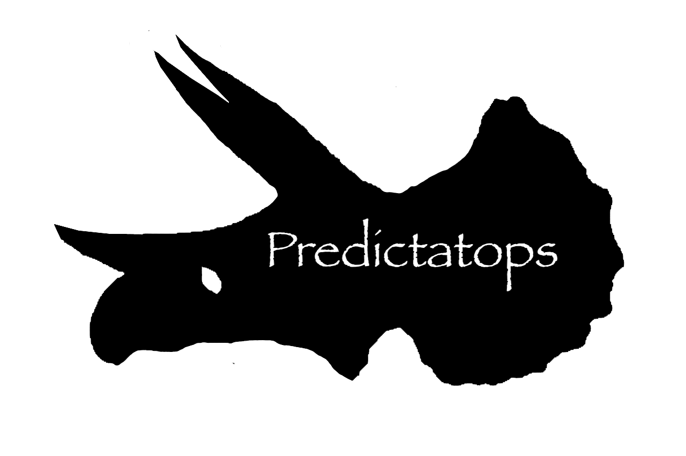
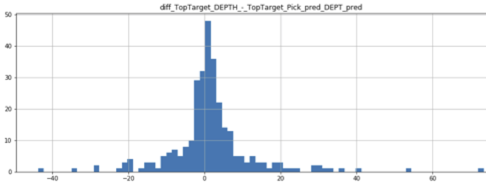

# predictatops

_Code for stratigraphic pick prediction via supervised machine-learning_

Further Information will eventually be in the docs <a href="https://justingosses.github.io/predictatops/html/index.html">here</a>.

<a href="https://github.com/JustinGOSSES/predictatops/blob/master/LICENSE">MIT License</a>

This code is the subject of an <a href="https://github.com/JustinGOSSES/predictatops/blob/master/AAPG_Abstract_2019ACE.md">abstract</a> submitted to the AAPG ACE convention in 2019. Tentative slides are <a href="https://1drv.ms/p/s!Ah1GtGqFjQIMlkkCTh5OaBGSYXLp"> here</a>.

Development was in this repo: <a href="https://github.com/JustinGOSSES/MannvilleGroup_Strat_Hackathon">MannvilleGroup_Strat_Hackathon</a> but is now moving here as the code gets cleaned and modulized. This project is under active development. A few portions of the code still only exist on MannvilleGroup_Strat_Hackathon repo at this time. This is a nights and weekend side project, but will continue to be developed by the main developer.

Philosophy
-------

In human-generated stratigraphic correlations there is often talk of lithostratigraphy vs. chronostratigraphy. We propose there is a weak analogy between lithostratigraphy and chronostratigraphy and different methods of computer assisted stratigraphy. 

Historically, many papers that attempted to use code to correlate well logs either assumed there was a mathematical or pattern basis for stratigraphic surfaces that can be teased out of individual logs or one could measured differences in curve patterns between neighboring wells. Some workflows share some characteristics with lithostratigraphy in terms of their reliance of matching curve shapes and assumption that changes in lithology are equivelant to stratigraphy, at least at distances equal or greater than well to well distances. 

In contrast, chronostratigraphy assumes lithology equates to facies belts that can fluctuate gradually in space over time, and are not correlated with time, resulting in two wells having similar lithology patterns in different time packages. Traditional chronostratigraphy relies on models of how facies belts should change in space when not otherwise constrained by biostratigraphy, chemostratigraphy, or radiometric dating. 

Instead of relying on stratigraphic models, this project proposes known picks can define spatial distribution of, and variance of, well log curve patterns that are then used to predict picks in new wells. This project attempts to focus on creating programatic features and operations that mimic the low level observations of a human geologist and progressively build into higher order clustering of patterns occuring across many wells that would have been done by a human geologist.

Datasets
-------
The default demo dataset used is a collection of over 2000 wells made public by the Alberta Geological Survey's Alberta Energy Regulator. To quote their webpage, "In 1986, Alberta Geological Survey began a project to map the McMurray Formation and the overlying Wabiskaw Member of the Clearwater Formation in the Athabasca Oil Sands Area. The data that accompany this report are one of the most significant products of the project and will hopefully facilitate future development of the oil sands." It includes well log curves as LAS files and tops in txt files and xls files. There is a word doc and a text file that describes the files and associated metadata. 

_Wynne, D.A., Attalla, M., Berezniuk, T., Brulotte, M., Cotterill, D.K., Strobl, R. and Wightman, D. (1995): Athabasca Oil Sands data McMurray/Wabiskaw oil sands deposit - electronic data; Alberta Research Council, ARC/AGS Special Report 6._

Please go to the links below for more information and the dataset:

Report for Athabasca Oil Sands Data McMurray/Wabiskaw Oil Sands Deposit http://ags.aer.ca/document/OFR/OFR_1994_14.PDF

Electronic data for Athabasca Oil Sands Data McMurray/Wabiskaw Oil Sands Deposit http://ags.aer.ca/publications/SPE_006.html Data is also in the repo folder: SPE_006_originalData of the original repo for this project <a href="https://github.com/JustinGOSSES/MannvilleGroup_Strat_Hackathon/tree/master/SPE_006_originalData">here.</a>

In the metadata file <a href="https://github.com/JustinGOSSES/MannvilleGroup_Strat_Hackathon/blob/master/SPE_006_originalData/Metadata/SPE_006.txt">SPE_006.txt</a> the dataset is described as `Access Constraints: Public` and `Use Constraints: Credit to originator/source required. Commercial reproduction not allowed.`

_The Latitude and longitude of the wells is not in the original dataset._ <a href="https://github.com/dalide">@dalide<a> used the Alberta Geological Society's UWI conversion tool to find lat/longs for each of the well UWIs. A CSV with the coordinates of each well's location can be found <a href="https://github.com/JustinGOSSES/MannvilleGroup_Strat_Hackathon/blob/master/well_lat_lng.csv">here.</a> These were then used to find each well's nearest neighbors.

Please note that there are a few misformed .LAS files in the full dataset, so the code in this repository skips those.

If for some reason the well data is not found at the links above, you should be able to find it <a href="https://github.com/JustinGOSSES/MannvilleGroup_Strat_Hackathon/tree/master/SPE_006_originalData">here.</a>

Architecture and Abstraction
-------
PLEASE REFER TO THE SECTION <a href="https://justingosses.github.io/predictatops/html/readme.html#architecture-and-abstraction">Architecture and Abstraction</a> in the DOCs. Information is provided on code architecture, tasks, and folder organization.

GettingStarted
-------
See the <a href="https://justingosses.github.io/predictatops/html/usage.html">Usage</a> and the <a href="https://justingosses.github.io/predictatops/html/installation.html">Installation</a> sections of the docs.

Credits
-------
There's a theme here. Check the <a href="https://justingosses.github.io/predictatops/html/authors.html">docs</a>.

______________________________
## Status

Small parts of the code are still in <a href="https://github.com/JustinGOSSES/MannvilleGroup_Strat_Hackathon">the old repository</a>, but it is progressively being moved here and repackaged out of Jupyter notebooks and into an actual package.

The code runs faster and and mean absolute error is down from 90 to 15.03 and now ~7 (with a handful of wells identified as too difficult to predict, -8% depending on settings. 

Key approaches were:
1. Leverage knowledge from nearby wells.
2. Instead of distinguishing between 2 classes, pick and not pick, distinguish between 3 classes: (a) pick, (b) not pick but within 3 meters and (c) not pick and not within 3 meters of pick.
3. More features
4. A Two step approach to machine-learning: 

- 4.1. First step is class-based prediction. Classes are groups based on distance from actual pick. For example, depths at the pick, depths within 0.5 meter, depths within 5 meters above, etc. 
- 4-2. Second step is more concerned with picking between the depths predicted as being in the classes nearest to the pick. We've explored both a rule-based scoring and a regression machine-learning process for this. 
- 4.2.1. The rule-based approach uses the class prediction and simple additive scoring of the class predictions based across different size windows. In a scenario where there are two depths with a predicted class of 100, we decide between them by adding up all the class scores across different size windows above and below each depth. The depth with the highest aggregate score wins  and it declared the "predicted depth". We take this route as we assume the right depth will have more depths near it that look like the top pick and as such have higher classes predicted for depths around it while false positives will be more likely to have more lower level classes around it.
- 4.2.2. We're also trying regression-based machine-learning to predict the distance from each depth in question to the actual pick. The depth with the lowest predicted distance between it and actual pick is chosen as the "predicted pick". This approach hasn't given any better results than the simple rule-based aggregate scoring.
 

#### Distribution of Absolute Error in Test Portion of Dataset for Top McMurray Surface in Meters. 
Y-axis is number of picks in each bin, and X-axis is distance predicted pick is off from human-generated pick.

Current algorithm used is XGBoost.

#### Future Work [also see issues]
7. Visualize probabilty of pick along well instead of just returning max probability prediction in each well. 
8. Generate average aggregate wells in different local areas for wells at different prediction levels. See if there are trends or if this helps to idenetify geologic meaningful features that correlate to many combined machine-learning model features. 
9. Explore methods to visualize weigtings of features on individual well basis using techniques similar to those learned in image-based deep-learning. 
10. Cluster wells using unsupervised learning and then see if clusters can be created that correlated with supervised prediction results. (initial trials with UMAP give encouraging results)
11. Rework parts of this into more object oriented approach.
12. Use H2O's automl library to try to improve on standard XGBoost approach.
